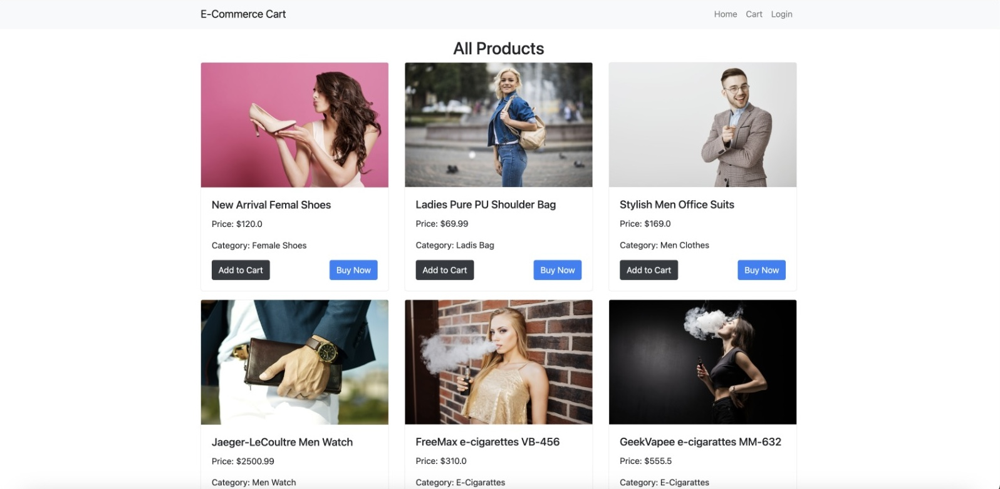

# E-Commerce Web Application 🛒
 

This repository contains an E-Commerce web application developed as a group assignment for the second-year first-semester project. The application is built using Java Enterprise Edition technologies, including Servlets, JSP, JDBC, HTML, CSS, and Java.

## Features 🚀

- User authentication and authorization 🔐
- Product browsing and search functionality 🔍
- Shopping cart management 🛍️
- Checkout process 💳
- Order management 📦
- Admin panel for managing products and users 👩‍💼👨‍💼

## Technologies Used 💻

- Java Enterprise Edition (Java EE) ☕
- Servlets 🔄
- JavaServer Pages (JSP) 🌐
- Java Database Connectivity (JDBC) 🗃️
- HTML 📝
- CSS 🎨

## Getting Started 🏁

To get started with this project, follow these steps:

1. Clone this repository to your local machine.
2. Set up your Java EE development environment.
3. Import the project into your IDE.
4. Configure the database connection settings.
5. Build and deploy the application to your application server.
6. Access the application through your web browser.

## Contributors 👥

- [Contributor 1](link-to-profile) 👨‍💻
- [Contributor 2](link-to-profile) 👩‍💻
- [Contributor 3](link-to-profile) 👨‍💻
- [Contributor 4](link-to-profile) 👩‍💻

## License 📄

This project is licensed under the [MIT License](LICENSE).
